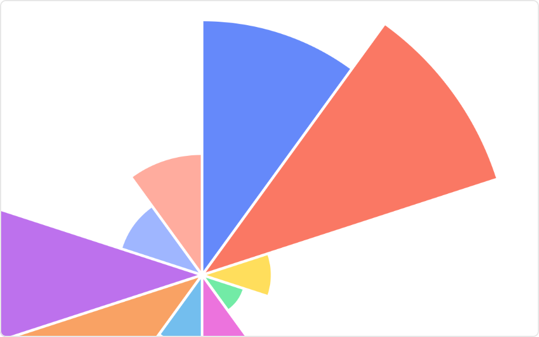

# Rose Chart Mod for Spotfire®

A similar visualization to a usual pie chart, except sectors are equal angles and differ rather in how far each sector extends from the center of the circle. Therefore, it’s important to notice with the rose chart that it’s the area, rather than the radius of a segment that represents its value.

A common use of a rose chart is in showing wind speed or noise levels. The 'axes' for the graph are the directions of a compass and the speed of the wind or the decibel level is then drawn in the appropriate direction.

## Installation & Use

[Download latest version](https://github.com/spotfiresoftware/spotfire-mod-rose/releases)

The [Wiki](https://github.com/spotfiresoftware/spotfire-mod-rose/wiki) contains step-by-step instruction on how to install and use this Mod in Spotfire®.

## Building the Project

In a terminal window:
- `npm install`
- `npm run build-watch`

In a new terminal window:
- `npm run server`

### Building for production

The development version of bundle.js is uncompressed and not suitable for end-users. Run the following command to compress the bundle:
- `npm run build`

## About Mods for Spotfire®
-   [Spotfire Community Exchange](https://community.spotfire.com/files/): A safe and trusted place to discover ready-to-use Mods
-   [Developer documentation](https://spotfiresoftware.github.io/spotfire-mods/docs/): Introduction and tutorials for Mods developers
-   [Mods examples](https://github.com/TIBCOSoftware/spotfire-mods/): A public repository for examples projects
